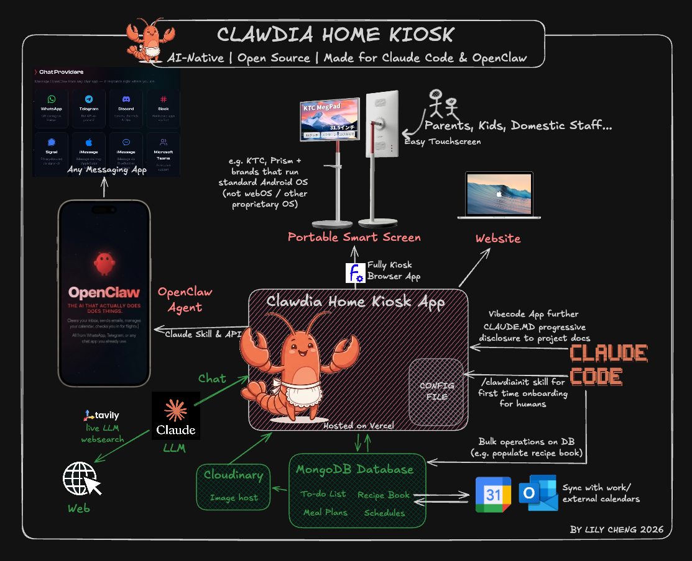

# **Clawdia — An AI-Native Home Kiosk App**

## **Customize with Claude Code, interact via OpenClaw**

> **Live demo:** [clawdia-demo.vercel.app](https://clawdia-demo.vercel.app/) — PIN: `123456` (dummy data, resets periodically, AI APIs calls are capped)

## Table of Contents

- [What is Clawdia?](#what-is-clawdia)
- [Open Source vs. Off-the-shelf?](#open-source-vs-off-the-shelf)
- [Key Features](#key-features)
- **Requirements**
  - [Recommended hardware](#recommended-hardware)
  - [Software & Services](#software--services)
- **First Time Setup**
  - [Step 1: Clone Clawdia Repo](#step-1--clone-clawdia-repo)
  - [Step 2: Customize and Set up Dependencies](#step-2--customize-and-set-up-dependencies)
  - [Step 3: Deploy to Vercel](#step-3--deploy-to-vercel)
  - [Step 4: Set up the Hardware](#step-4--set-up-the-hardware)
  - [Step 5 (Optional): Integration with OpenClaw](#step-5-optional--integration-with-openclaw-or-any-external-ai-agent)
- **Future Maintenance & Security**
  - [Documentation reference](#documentation-reference)
  - [Pulling updates from Clawdia public repo](#pulling-updates-from-clawdia-public-repo)
  - [Optional security hardening](#optional-security-hardening)

---

## What is Clawdia?

A **Claude Code-native, open-source home kiosk App** with a simple, touch-friendly interface designed to be used by anyone in the household, including children and staff. It runs on a **_Portable Smart Screen_** (wall mounted or free standing) and supercharges all the things a household needs to track day-to-day: a home calendar that can pull or publish external feeds (google/outlook), weekly meal planning, to-do lists which can be auto-generated, saved links, and a Voice-enabled AI chat interface where you can ask Claude to do things for you instead of clicking around.

For parents, there are two additional layers of convenience. The [**OpenClaw**](https://github.com/openclaw) integration lets you read and update the kiosk from WhatsApp, Signal, Telegram, or any other messaging platform — useful when you're out and want to check the week's meals or add a calendar event without walking to the screen. And because it's just a web app, **parents can access the full interface from any browser** — handy when travelling and you still want to check the schedule or update the meal plan from your phone or laptop.

Because the entire app — including all its data and logic — is open and accessible to Claude Code, you can automate almost any content or configuration task or build in highly bespoke logic just by describing what you want. A CLAUDE.MD file is in the repo for claude to read when it first starts with links to modular documentation for progressive disclosure.

The app is named **Clawdia** as it was built from ground up to be used with Claude Code and OpenClaw. You can rename it and replace the mascot images to make it your own.

> _Creator's Note: This started as a project for myself. I was spending so much time as the go between between school, kids, staff... I wanted a system that those in my family who do not have their own devices (staff, kids) can also iteract with. _
> _I first considered off-the-shelf systems but they many used proprietary hardware and software without APIs for external AI agents to connect, control and manipulate. I didn't want to invest a lot of time and money into a system that is not AI-native. With proprietary systems, I would inevitably end up spending a lot of time populating content manually (like the recipe book) vs. being able to use AI to automate or end up in a place where the software just cannot provide a level of customization that would make it truly useful to my household. So I started Clawdia. This is a work in progress but am happy to share it!_

---

## Open Source vs. Off-the-shelf?

- **No hardware lock-in** — Clawdia uses a Portable Smart Screen that runs standard Android. If you ever decide to get rid of your Kiosk or to upgrade to something else, your device can be turned into TV or just use as a tablet.
- **No subscription fees** — the underlying services (MongoDB Atlas, Vercel, Cloudinary, Tavily) all have free tiers sufficient for a household. The only thing you need to buy is the screen and pay a lifetime $10 for the "Fully Kiosk Brower App" that turns your android device into a Kiosk like what you see at McDonalds.
- **Your data is under your control** — everything lives in your own MongoDB Atlas instance; no vendor lock-in, no data sharing, you can bypass the UI and ask AI to manipulate the data however you like.
- **Customisable appearance and branding** — rename the app, swap the logo [I haven't added theming yet - will add on the to-do list]
- **Compatible with AI agents like OpenClaw** — It's pretty dang amazing to be able to control my home kiosk by chatting to it on whatsapp, or to run cronjobs to read to-do lists and to send it to the right people each morning so even if they forget to look at the Kiosk, there is a reminder.
- **Extend it yourself** — With Claude Code, you easily can do whatever you like to make it EXACTLY the way you want it. The more changes you make
- **Security** — For ease of use and given the lack of sensitivity of the data in a home system, a simple 6-digit PIN code is used. It's the same code for everyone so there are no usernames/password accounts - which clearly is not foolproof security-wise. For a higher level of security, check out the "security hardening" section.

---

## Key Features

- **Meal planner** — weekly meal grid with a recipe bank, dish photos, and ingredient prep view
- **Schedule** — shared family calendar with week, month, and year views; supports recurring events and external ICS feed sync
- **To-do list** — shared task list with assignees, auto-generated reminders from your calendar, and a cron job that refreshes daily
- **AI Voice Chat** — a floating chat panel powered by Claude Code to make changes to all of the above without clicking buttons.
- **PIN lock** — simple shared PIN protects the whole app
- **Messaging integration** — connect an [OpenClaw](https://github.com/openclaw) agent to WhatsApp, Signal, Telegram, etc. to read and write household data via chat (see below)

---

# Requirements

## Recommended hardware

**Screen:** The app is designed for a portrait-orientation _Portable Smart Screen_ running standard Android OS. I used a [Prism+ Roam 32" Ultra](https://prismplus.sg) — a 32" Android tablet in portrait orientation. The large size makes it genuinely useful as a household dashboard; small tablets tend to end up ignored. In other markets, it might be branded as **KTC MegPad 32" 4K Android 13**

**Kiosk Loading App:** [Fully Kiosk Browser](https://www.fully-kiosk.com) — a simple Android app (US$10 lifetime license for Pro) that can be downloaded from Google Play loads the Clawdia web app as a dedicated kiosk (prevents exiting from Kiosk mode without admin code). It also has features like **Motion-triggered screen wake** — uses the tablet's front camera to detect movement and wake the screen automatically. The screen stays off when no one is nearby and lights up as you approach.

---

## Software & Services

- **Next.js 15** (App Router) — React, server components, API routes
- **MongoDB Atlas** — all app data, free M0 cluster is sufficient
- **Vercel** — hosting and cron jobs (free Hobby plan)
- **Tailwind CSS** — styling
- **Cloudinary** — dish photo storage _(highly recommended)_
- **Anthropic API** — AI Chat
- **Tavily** — recipe web search _(highly recommended)_

---

# First Time Setup

## STEP 1: Clone Clawdia Repo

The recommended way to use this project is to keep your **private repo** (with your real family config) as a fork of this **public repo**, so you can pull updates from the public repo over time without losing your private configuration. Your private config files (`config/family.ts`, private scripts) are gitignored in the public repo, so they live only in your private repo and will never be touched by upstream merges.

Open **Terminal** (macOS/Linux) or **Git Bash** (Windows) and navigate to a directory where you want the project to live (e.g. `~/Projects`):

```bash
cd ~/Projects

# Clone the public repo
git clone https://github.com/ririgriff/clawdia-home-kiosk.git clawdia
cd clawdia

# Create a new private repo on GitHub (via the website or gh CLI), then:
git remote rename origin upstream
git remote add origin git@github.com:your-username/clawdia-private.git
git push -u origin main
```

Navigate to the project folder (e.g. ~/Projects/clawdia) in a code editor, open `.gitignore` and delete everything below the `IGNORED IN PUBLIC REPO ONLY` divider. This allows Git to track your private config files normally in the private repo:

```bash
# Delete these lines from .gitignore:
#
#   # IGNORED IN PUBLIC REPO ONLY — track these in your private repo
#   config/family.ts
#   scripts/*
#
# Keep everything above the divider.
```

Copy and edit your config:

```bash
cp config/family.example.ts config/family.ts
# Edit config/family.ts with your real household details
```

Commit your private config to your private repo. It will never appear in the public repo.

---

## STEP 2: Customize and Set up Dependencies

The easiest way to configure Clawdia is with **Claude Code**, Anthropic's AI coding assistant that runs in your terminal. It can read the entire project, understand the config files, and make changes for you — just describe what you want in plain English.

**If you don't have Claude Code installed**, follow the official setup guide: [https://docs.anthropic.com/en/docs/claude-code/overview](https://docs.anthropic.com/en/docs/claude-code/overview)

Once installed, open your terminal, navigate to the project directory, and start Claude Code:

```bash
cd ~/Projects/clawdia
claude --dangerously-skip-permissions
```

Then run the built-in setup skill:

```
/clawdiainit
```

This will walk you through configuring your household members, app name, environment variables, and external services step by step.

**Prefer to configure manually?** You only need to edit two files:

1. **`config/family.ts`** — household members, app branding, auto-todo rules, and all household-specific logic. Copy from `config/family.example.ts` if you haven't already — it's heavily commented with instructions for every section.
2. **`.env.local`** — API keys and secrets. Copy from `env.example` — each variable is documented inline.

For a detailed walkthrough of every option, see the [manual-configuration.md](./docs/manual-configuration.md).

---

## STEP 3: Deploy to Vercel

1. **Create a Vercel account** at [vercel.com](https://vercel.com) (free Hobby plan is sufficient)
2. **Link your GitHub repo** — from the Vercel dashboard, click **Add New → Project**, then select your private Clawdia repo
3. **Add environment variables** — before deploying, go to **Settings → Environment Variables** and add every variable from your `.env.local` file. At minimum you need:

   | Variable                | Required?                                                      |
   | ----------------------- | -------------------------------------------------------------- |
   | `MONGODB_URI`           | Yes                                                            |
   | `KIOSK_PIN`             | Yes                                                            |
   | `AUTH_SALT`             | Yes                                                            |
   | `ANTHROPIC_API_KEY`     | Yes                                                            |
   | `CRON_SECRET`           | Yes — needed for daily auto-todo and calendar sync cron jobs   |
   | `AGENT_API_KEY`         | Only if using OpenClaw messaging integration                   |
   | `CLOUDINARY_CLOUD_NAME` | Recommended — enables dish photo uploads                       |
   | `CLOUDINARY_API_KEY`    | Recommended                                                    |
   | `CLOUDINARY_API_SECRET` | Recommended                                                    |
   | `TAVILY_API_KEY`        | Recommended — enables recipe web search                        |
   | `ICS_FEED_URL`          | Optional — external calendar sync                              |
   | `ICAL_SECRET`           | Optional — lets external apps subscribe to your kiosk calendar |

4. **Deploy** — click Deploy. Vercel will build and host the app automatically
5. **Verify** — open your Vercel deployment URL in any browser (e.g. `https://your-app.vercel.app`), enter your PIN, and confirm everything works - just keep in mind that the UI was designed for a portrait mode large touch screen so it might look a little awkward. Try navigating around the app to make sure your data and configuration are correct before setting up the kiosk.

> **Note:** Cron jobs defined in `vercel.json` (daily auto-todo generation and calendar sync) start running automatically once deployed. They use the `CRON_SECRET` you set above.

> **Auto-deploy:** Once your GitHub repo is linked, every `git push` to your main branch will automatically trigger a new Vercel deployment. No manual deploys needed — just push your changes and the live app updates within a couple of minutes.

### Troubleshooting common issues

**App loads but features don't work / API errors after setup**

- Environment variables added or changed in Vercel do not take effect until you redeploy. Go to your Vercel project dashboard → **Deployments** → click the three-dot menu on the latest deployment → **Redeploy**.
- If you push environment variables from env.local to Vercel using Vercel CLI, sometimes it appends a trailing space - need to go delete those.

**App can't connect to MongoDB / blank data / 500 errors**
MongoDB Atlas requires you to whitelist the IPs that are allowed to connect. During setup, set the Network Access to `0.0.0.0/0` (allow all IPs) — this is necessary because free Vercel uses dynamic outbound IPs. If you skipped this step, go to **MongoDB Atlas → Network Access → Add IP Address → Allow Access from Anywhere**. See the [security hardening](#optional-security-hardening) section if you want to restrict this later.

---

## STEP 4: Set up the Hardware

Once you've verified the app is working in a browser, set it up on your Portable Smart Screen:

**Install Fully Kiosk Browser** — download [Fully Kiosk Browser](https://www.fully-kiosk.com) from Google Play on your Android tablet (US$10 one-time license for Pro)

**Set the Start URL** — open Fully Kiosk Browser, go to **Settings → Web Content Settings → **

**Start URL** and enter your Vercel deployment URL (e.g. `https://your-app.vercel.app`)

**Enable kiosk mode** — under **Settings → Kiosk Mode**, toggle on **Enable Kiosk Mode**. This prevents users from exiting the app without an admin PIN

**Set up motion wake** _(optional but recommended)_ — under **Settings → Motion Detection**, enable **Motion Detection to Activate Screen**. This uses the tablet's front camera to wake the screen when someone walks by

## 🦞Clawdia🦞 is ready!

---

## STEP 5 (Optional): Integration with OpenClaw (or any external AI agent)

The kiosk exposes a set of **agent skills** that allow an AI assistant running on a separate machine to read and write your household data remotely. If you run an [OpenClaw](https://github.com/openclaw) agent connected to a messaging app (WhatsApp, Signal, Telegram, or anything else OpenClaw supports), household members can interact with the kiosk through ordinary chat messages — without being in front of the Kiosk.

### What you can do via messaging

| Skill            | What it covers                                                                                                                                                                                                                                                                                                                                                                                                   |
| ---------------- | ---------------------------------------------------------------------------------------------------------------------------------------------------------------------------------------------------------------------------------------------------------------------------------------------------------------------------------------------------------------------------------------------------------------- |
| **Meal planner** | Ask what's planned for a day, add dishes to the recipe bank, log what's been cooked\n\n> 💡 **\*Suddenly you think of a dish that your family might like: \*\*** _ OpenClaw can help to create a new dish entry (it will go in the "review" tab for completion later so you don't forget the idea. \n> 💡 you can message your agent _"What are we having for dinner this week? and what do I need to buy?"\* \n |
| **Schedule**     | Read upcoming events, add new calendar events, query who has what on\n\n> 💡 _Add dentist appointment for Charlie on Thursday at 3pm"_ and it will read from or write to the kiosk database directly.                                                                                                                                                                                                            |
| **To-do list**   | List open tasks, add new to-dos, mark items complete\n\n> 💡 _You want to be reminded of to-dos at 7am every morning: _ OpenClaw can run a cronjob to pull the to-do list every morning and deliver as a message. \n                                                                                                                                                                                             |

### How it works

Each skill is a two-part design:

1. **A tiny bootstrap file** (`openclaw-skill/<module>/SKILL.md`) — installed once on the agent machine. It just tells the agent where to fetch its real instructions. ***These SKILL.MD files (one for each module) needs to be given to the OpenClaw (or other external AI agent) as a skill. ***To avoid needing to keep manually updating these files, these bootstrap files simply tells the agent what the skill is and instructs the agent to pull details from the server.
2. **A server-side skill route** (`/api/agent/skill?module=<name>`) — the actual workflows, field names, and rules live here, built dynamically from your config. Updating skill behaviour only requires deploying the app — no changes needed on the agent machine.

Agent API calls are authenticated with a Bearer token (`AGENT_API_KEY`). Items added via the agent (new dishes, to-dos, events) land in a pending/review state so you can approve them through the kiosk UI before they go live.

### Setup

1. Deploy the kiosk app to Vercel and ensure `AGENT_API_KEY` is set in your environment variables
2. Copy the `openclaw-skill/` directory to `~/.openclaw/skills/` on the agent machine where you have the external AI agent like OpenClaw running.
3. Set two environment variables on the agent machine:

| Variable          | Value                                                                  |
| ----------------- | ---------------------------------------------------------------------- |
| `KIOSK_API_BASE`  | Your Vercel deployment URL (e.g. `https://your-app.vercel.app`)        |
| `KIOSK_AGENT_KEY` | The same value as `AGENT_API_KEY` in your Vercel environment variables |

4. Chat to your OpenClaw via your usual messaging platform and invoke these skills to interact with Clawdia!

---

# Future Maintenance & Security Settings

## Documentation reference

The `docs/` folder contains detailed reference material for each part of the app:

| File                           | Contents                                                                                                                             |
| ------------------------------ | ------------------------------------------------------------------------------------------------------------------------------------ |
| `docs/manual-configuration.md` | Step-by-step configuration guide for users who prefer to edit files directly rather than using the `/clawdiainit` Claude Code wizard |
| `docs/system-architecture.md`  | Full system overview — API routes, data models, authentication, external services, and environment variables                         |
| `docs/meals-module.md`         | Meal planner data model, API patterns, and UX decisions                                                                              |
| `docs/schedule-module.md`      | Calendar, recurring events, ICS sync, and Go Home feature                                                                            |
| `docs/todo-module.md`          | To-do list, assignees, auto-generated todos, and cron behaviour                                                                      |
| `docs/links-module.md`         | Saved links feature                                                                                                                  |
| `docs/ai-chat.md`              | In-app AI chat — tools, voice input, and agent integration                                                                           |

---

## Pulling updates from Clawdia public repo

[WORK IN PROGRESS!! Still learning how to maintain a public repo]
Whenever the public repo has new bug fixes / features:

```bash
git fetch upstream
git merge upstream/main
```

### Files to leave untouched

To keep upstream merges clean, **avoid editing these files directly** unless you have a specific reason:

| File                     | Why                                                                      |
| ------------------------ | ------------------------------------------------------------------------ |
| `app/` and `components/` | Core app — upstream changes land here                                    |
| `lib/`                   | Shared logic — upstream changes land here                                |
| `lib/types.ts`           | Link/dish category definitions — safe to edit, but may conflict on merge |
| `middleware.ts`          | PIN auth — only change if you know what you're doing                     |
| `vercel.json`            | Cron schedule — safe to edit, low conflict risk                          |

| File               | What it controls                                                                                                                                                                                          |
| ------------------ | --------------------------------------------------------------------------------------------------------------------------------------------------------------------------------------------------------- |
| `config/family.ts` | Everything household-specific — members, colours, rules, AI description                                                                                                                                   |
| `.env.local`       | Secrets and API keys                                                                                                                                                                                      |
| `public/`          | Mascot images and any static assets                                                                                                                                                                       |
| `CLAUDE.md`        | Claude Code instructions — the technical rules apply to all forks, but the **Documentation & Git Workflow** section is specific to the public repo. Customize or replace that section for your own setup. |

---

## Optional security hardening

The default setup prioritises ease of deployment. Once you're up and running, here are optional steps to tighten security:

### MongoDB Atlas — restrict IP access

During setup you allowed `0.0.0.0/0` so Vercel could connect (Vercel uses dynamic IPs). This is fine for a private household app. If you want to lock it down:

- **Vercel Pro/Enterprise** — enables static outbound IPs. Add those specific IPs to MongoDB Atlas Network Access instead of `0.0.0.0/0`.
- **Scoped database user** — create a dedicated MongoDB user with `readWrite` access only to your Clawdia database (not all databases). Under Atlas → Database Access, set the built-in role to `readWrite` on the specific database.

### Vercel deployment protection

Under Vercel → Project Settings → Deployment Protection, you can enable **Vercel Authentication** to require a Vercel login before the site loads. This adds a layer on top of the app's PIN auth — useful if you're concerned about the deployment URL being publicly discoverable.

---

##
