# Home Kiosk App — System Architecture

```mermaid
flowchart TD

    %% ── CLIENTS ─────────────────────────────────────────────────────────────────

    TABLET["🏠 Wall Tablet · Fully Kiosk Browser\nportrait 32 · touch-only · no keyboard"]

    subgraph AGENT_SYS["External Agent Machine (separate server)"]
        WHATSAPP["💬 WhatsApp"]
        OPENCLAW["🤖 External Agent · OpenClaw framework\nclaude-sonnet-4-6\nFetches full skill prompt from /api/agent/skill at runtime\nEnv: KIOSK_API_BASE · KIOSK_AGENT_KEY"]
    end

    VCRON["⏰ Vercel Cron Scheduler\ntodos  → 0 22 * * * UTC = 06:00 HK\nics-sync → 0 2 * * * UTC = 10:00 HK\nAuto-sends Bearer CRON_SECRET"]

    CALAPP["📅 External Calendar Apps\niCal subscribers"]

    %% ── VERCEL APP ───────────────────────────────────────────────────────────────

    subgraph VERCEL["☁️  Vercel — your-app.vercel.app · Next.js 15 App Router"]

        %% Middleware
        subgraph MW["🔒 Middleware · proxy.ts (runs on every request)"]
            PIN_MW["PIN Cookie Guard\nSHA-256(PIN + AUTH_SALT) · httpOnly · Secure · 30-day\nRate limit: 5 attempts / 15-min lockout per IP\nRedirects unauthenticated → /pin"]
            BEARER_MW["Bearer Token Guard\nAGENT_API_KEY for /api/agent/*\nCRON_SECRET for /api/cron/*\nICAL_SECRET query param for /api/ical"]
        end

        %% Pages
        subgraph PAGES["📄 Next.js Pages (client components, PIN-protected)"]
            PG_HOME["/ · Home Dashboard\n├ MealSummary — today & tomorrow\n├ RemindersPanel — next 7 days todos\n├ ScheduleSummary — today's events\n├ GoHome banner (school child's transport method)\n└ AI Chat — floating 128px button\n   Large mic button · SSE streaming chat"]
            PG_PLAN["/plan · Meal Planner\n├ WeeklyGrid — 7-day × 4-slot grid\n├ MealSlotCell — tap overlay · favorites hearts\n├ RecipeDrawer — slide-up dish picker\n│  pre-filtered by slot + favorites (per-member)\n├ WhoForPicker — Adults / Kids / Everyone\n└ Drag & drop via dnd-kit"]
            PG_MEALS["/meals · Dish Manager\n├ Card grid — photo · name · tags\n├ Search · category · tag filters\n├ AddDishModal — create/edit\n│  Cloudinary image upload\n│  Ingredient parser (Claude)\n│  Recipe URL fetch (Claude)\n├ Availability toggle (inline)\n└ Review queue — pending agent dishes\n   Approve / Edit+Approve / Reject"]
            PG_SCHED["/schedule · Calendar\n├ Week / Month / Year views\n├ Event chips — type-coloured\n│  titles wrap (no truncate)\n├ GoHome strip (below 10pm)\n└ Todo strip — inline checkbox\n   Edit bottom sheet per item"]
            PG_TODO["/todo · Full To-Do List\n├ 7-day date groups\n├ General (undated) section\n├ Assignee filter chips\n├ Inline title editing\n├ Auto→manual conversion\n└ Completed section (collapsible)"]
            PG_GOHOME["/settings/go-home\nConfigure school child's default\ntransport per weekday\n(pickup / bus-3pm / bus-4pm)"]
        end

        %% Internal API
        subgraph INT_API["🔌 Internal API · PIN cookie required"]
            AUTH["/api/auth\nPOST · verify PIN\nset kiosk-auth cookie\nwrite ratelimit record"]
            DISHES_API["/api/dishes\n/api/dishes/:id\nGET list (excludes recipe/notes)\nGET ?status=pending (review queue)\nPOST create · PUT $set · DELETE"]
            MEALPLAN_API["/api/meal-plan?weekStart=YYYY-MM-DD\n/api/meal-plan/:id\nGET — enriched with dish fields\nPOST add entry · DELETE remove"]
            SCHED_API["/api/schedule?from=&to=\n/api/schedule/:id\nGET range — expands recurring instances\nPOST create · PUT $set · DELETE\nRecurring IDs: mongoId_YYYY-MM-DD"]
            TODO_API["/api/todos\n/api/todos/:id\nGET all (dated asc · undated last)\nPOST create · PUT update\ndone:true → sets doneAt\ndone:false → clears doneAt\nDELETE"]
            LINKS_API["/api/links · /api/links/:id\nGET · POST · PUT · DELETE\nCategories: from LINK_CATEGORIES in lib/types.ts"]
            SETTINGS_API["/api/settings/go-home\nGET / PUT weekday defaults\nStored in Settings collection"]
            TAXONOMY_API["/api/taxonomy · /api/taxonomy/:id\nGET — auto-seeds 9 categories + 15 tags\nPOST create tag/category · DELETE"]
            UPLOAD_API["/api/upload\nPOST multipart image\n→ Cloudinary home-kiosk/dishes\nReturns secure_url"]
            RECIPE_API["/api/fetch-recipe\nPOST {url}\nFetch page → try JSON-LD\nFallback: Claude extraction\nclaude-opus-4-6"]
            PARSE_API["/api/parse-ingredients\nPOST {text}\nClaude structured extraction\nclaude-opus-4-6\nReturns name/quantity/unit[]"]
            CHAT_API["/api/chat\nPOST · SSE streaming\nclaude-sonnet-4-6 (default)\nSystem: family context · HK time\n30 tools · multi-turn tool loop\nBreaks on end_turn"]
            ICAL_EXPORT["/api/ical?token=ICAL_SECRET\nGET · RFC 5545 VCALENDAR\nOptional: &participant= &type=\nVTIMEZONE: Asia/Hong_Kong\nRRULE for weekly recurring\nCRLF fold · text escaping"]
        end

        %% Agent API
        subgraph AGENT_API["🤖 Agent API · Bearer AGENT_API_KEY"]
            AG_SKILL["/api/agent/skill?module=\nGET · plain text skill prompt\nBuilt dynamically server-side\nModules: meals · schedule · todos · links\nNo agent-machine update needed on change"]
            AG_SCHEMA["/api/agent/schema\nGET · taxonomy · field reference\nEndpoint listing for agents"]
            AG_DISHES["/api/agent/dishes\nGET active dishes (dedup check)\nPOST → always lands as pending\ntags source: agent"]
            AG_MEALPLAN["/api/agent/mealplan?date=\nGET · grouped by slot + who_for"]
            AG_SCHED["/api/agent/schedule\nGET / POST / PUT / DELETE\nRecurring: strip _YYYY-MM-DD suffix\nWarning: edits affect entire series\nICS-feed events read-only"]
            AG_TODOS["/api/agent/todos\nGET (date / all / undone)\nPOST · PUT · DELETE\nsource: agent on create\nauto→manual via source field"]
            AG_LINKS["/api/agent/links\nGET / POST / PUT / DELETE"]
            AG_GOHOME["/api/agent/go-home?date=\nGET · returns transport method\nCalls computeHomeMethod()"]
        end

        %% Cron API
        subgraph CRON_API["⏰ Cron API · Bearer CRON_SECRET"]
            CRON_TODOS["/api/cron/todos\n0 22 * * * UTC = 06:00 HK\nGenerates today + tomorrow\nCalls generateTodosForDate()"]
            CRON_ICS["/api/cron/ics-sync\n0 2 * * * UTC = 10:00 HK\nFetches ICS_FEED_URL\nUpserts by external_uid\nDeletes removed events"]
        end

        %% Business Logic
        subgraph BIZ["⚙️  Business Logic · lib/"]
            HOMEMETHOD["home-method.ts · computeHomeMethod(events, date, defaults)\n① Weekend → null (no chip shown)\n② School holiday / public holiday → null\n③ Any school child appointment event → pickup\n④ Latest school child event end > PICKUP_AFTER → pickup\n⑤ Latest school child event end > BUS_LATE_AFTER → bus-4pm\n⑥ Per-day default from Settings DB\nNote: receives full unfiltered event array\n(multi-day holidays must span their full range)"]
            AUTOGEN["todo-auto-gen.ts · generateTodosForDate(dateStr)\nFetches schedule events for date\nEvaluates AUTO_GEN_RULES from config/family.ts\n6 condition types: go_home_pickup · appointment_for_school_child\n  day_of_week · day_of_month · nth_weekday_of_month · days_before_event\nUpsert by autoGenKey · skips if key exists\nautoGenKey preserved on auto→manual convert"]
            ICS_PARSER["ICS Parser (in cron/ics-sync)\nRFC 5545 VEVENT extraction\nUnfold multi-line continuations\nParse DTSTART / DTEND + TZID\nStrip timezone → store as local time\nAuto-detect participants from title (ICS_PARTICIPANT_KEYWORDS)\ntype: travel · source: ics-feed\nexternal_uid dedup · skip Canceled: prefix"]
            ICAL_BUILDER["iCal Builder (in /api/ical)\nVCALENDAR · PRODID · VERSION\nVTIMEZONE block for Asia/Hong_Kong\nVEVENT per event\nRRULE:FREQ=WEEKLY;BYDAY=MO,TU…\nX-WHO: participant list\nFold lines at 75 octets · CRLF"]
        end

    end

    %% ── EXTERNAL SERVICES ────────────────────────────────────────────────────────

    subgraph EXT["External Services"]

        subgraph MONGODB["🍃 MongoDB Atlas (mongoose 9 · connection pooling · .lean() on reads)"]
            DB_DISHES[("dishes\nname · name_zh · category[] · tags[]\nfavorites[] — member IDs who like this dish\nstatus: pending / active / archived\nsource: manual / agent\nimage_url · recipe · ingredients[]\navailable · critical_notes · who_for\ntypically_served[] · reference_url\nIndex: status + name")]
            DB_MEALPLAN[("mealplans\ndate · slot · dish_id · who_for\nIndex: date + slot")]
            DB_SCHED[("scheduleevents\ntitle · type · participants[]\nstart · end · all_day\nlocation · notes\nrecurrence: frequency/days/until\nsource · external_uid\ntravel_type · origin · destination\nIndex: start · type")]
            DB_TODOS[("todoitems\ntitle · date · assignee\ndone · doneAt · source\nautoGenKey (unique sparse)\ncreatedAt\nIndex: date+createdAt · done+doneAt")]
            DB_LINKS[("links\ncategory · title · url · notes · order")]
            DB_TAXONOMY[("taxonomy\ntype: category / tag\nvalue · label · color\n9 categories · 13 tags")]
            DB_SETTINGS[("settings\nkey: go-home\nvalue: {mon:pickup, tue:bus-3pm …}")]
            DB_RATELIMITS[("ratelimits\nip · attempts · lockedUntil\nTTL 15 min auto-cleanup")]
        end

        CLOUDINARY["☁️  Cloudinary\nFolder: home-kiosk/dishes\nStores as secure_url in dishes.image_url"]

        subgraph ANTHROPIC["🧠 Anthropic API"]
            SONNET["claude-sonnet-4-6\n· AI Chat (30 tools · streaming)\n· External Agent agent reasoning"]
            OPUS["claude-opus-4-6\n· Recipe URL extraction\n· Ingredient text parsing"]
        end

        ICS_URL["📅 ICS Feed\nOutlook / Exchange calendar\nExternal flight bookings\nenv: ICS_FEED_URL"]

    end

    %% ── CONNECTIONS ──────────────────────────────────────────────────────────────

    %% Family → App
    TABLET -->|"HTTPS · all requests"| PIN_MW
    PIN_MW -->|"valid cookie"| PAGES
    PIN_MW -.->|"missing/invalid cookie → redirect"| AUTH

    %% External Agent WhatsApp
    WHATSAPP <-->|"messages"| OPENCLAW
    OPENCLAW -->|"GET skill prompt first"| AG_SKILL
    OPENCLAW -->|"Bearer AGENT_API_KEY"| AG_DISHES
    OPENCLAW -->|"Bearer AGENT_API_KEY"| AG_MEALPLAN
    OPENCLAW -->|"Bearer AGENT_API_KEY"| AG_SCHED
    OPENCLAW -->|"Bearer AGENT_API_KEY"| AG_TODOS
    OPENCLAW -->|"Bearer AGENT_API_KEY"| AG_LINKS
    OPENCLAW -->|"Bearer AGENT_API_KEY"| AG_GOHOME

    %% Bearer guard
    BEARER_MW --> AGENT_API
    BEARER_MW --> CRON_API

    %% Vercel cron triggers
    VCRON -->|"POST · Bearer CRON_SECRET"| CRON_TODOS
    VCRON -->|"POST · Bearer CRON_SECRET"| CRON_ICS

    %% Pages → Internal API
    PG_HOME --> CHAT_API
    PG_HOME --> MEALPLAN_API
    PG_HOME --> TODO_API
    PG_HOME --> SCHED_API
    PG_PLAN --> MEALPLAN_API
    PG_PLAN --> DISHES_API
    PG_PLAN --> TAXONOMY_API
    PG_MEALS --> DISHES_API
    PG_MEALS --> TAXONOMY_API
    PG_MEALS --> UPLOAD_API
    PG_MEALS --> RECIPE_API
    PG_MEALS --> PARSE_API
    PG_SCHED --> SCHED_API
    PG_SCHED --> SETTINGS_API
    PG_TODO --> TODO_API
    PG_GOHOME --> SETTINGS_API

    %% AI Chat → Claude (30 tools)
    CHAT_API <-->|"streaming · tool calls · tool results"| SONNET

    %% Recipe & ingredient extraction → Claude
    RECIPE_API -->|"claude-opus-4-6"| OPUS
    PARSE_API -->|"claude-opus-4-6"| OPUS

    %% Image upload → Cloudinary
    UPLOAD_API -->|"multipart upload"| CLOUDINARY
    CLOUDINARY -.->|"secure_url"| DB_DISHES

    %% iCal export
    CALAPP -->|"GET ?token=ICAL_SECRET"| ICAL_EXPORT
    ICAL_EXPORT --> ICAL_BUILDER
    ICAL_BUILDER --> DB_SCHED

    %% Internal API ↔ MongoDB
    AUTH --> DB_RATELIMITS
    DISHES_API <-->|"$set updates"| DB_DISHES
    MEALPLAN_API <-->|"enriched with dish fields"| DB_MEALPLAN
    MEALPLAN_API --> DB_DISHES
    SCHED_API <-->|"$set updates · recurring expansion"| DB_SCHED
    TODO_API <-->|"$set · done/doneAt"| DB_TODOS
    LINKS_API <--> DB_LINKS
    SETTINGS_API <--> DB_SETTINGS
    TAXONOMY_API <--> DB_TAXONOMY

    %% Agent API ↔ MongoDB
    AG_DISHES <-->|"pending on write"| DB_DISHES
    AG_MEALPLAN --> DB_MEALPLAN
    AG_SCHED <--> DB_SCHED
    AG_TODOS <--> DB_TODOS
    AG_LINKS <--> DB_LINKS

    %% GoHome business logic
    AG_GOHOME --> HOMEMETHOD
    PG_HOME --> HOMEMETHOD
    PG_SCHED --> HOMEMETHOD
    HOMEMETHOD --> DB_SCHED
    HOMEMETHOD --> DB_SETTINGS

    %% Cron → business logic → DB
    CRON_TODOS --> AUTOGEN
    AUTOGEN --> HOMEMETHOD
    AUTOGEN -->|"upsert by autoGenKey"| DB_TODOS
    AUTOGEN --> DB_SCHED

    CRON_ICS --> ICS_PARSER
    ICS_PARSER -->|"HTTP GET feed"| ICS_URL
    ICS_PARSER <-->|"upsert external_uid · delete removed"| DB_SCHED
```

---

## Environment Variables

| Variable | Used by | Purpose |
|---|---|---|
| `MONGODB_URI` | `lib/mongodb.ts` | MongoDB Atlas connection string |
| `KIOSK_PIN` | `/api/auth` | PIN for kiosk access |
| `AUTH_SALT` | `proxy.ts` · `/api/auth` | Secret for SHA-256 PIN hashing |
| `ANTHROPIC_API_KEY` | `/api/chat` · `/api/fetch-recipe` · `/api/parse-ingredients` | Claude API |
| `CLOUDINARY_CLOUD_NAME` | `/api/upload` | Cloudinary account |
| `CLOUDINARY_API_KEY` | `/api/upload` | Cloudinary credentials |
| `CLOUDINARY_API_SECRET` | `/api/upload` | Cloudinary credentials |
| `AGENT_API_KEY` | `/api/agent/*` · External Agent machine | Bearer token for External Agent agent |
| `CRON_SECRET` | `/api/cron/*` | Bearer token for Vercel cron |
| `ICS_FEED_URL` | `/api/cron/ics-sync` | External Outlook/Exchange calendar feed |
| `ICAL_SECRET` | `/api/ical` | Token for iCal export endpoint |

---

## Data Flow Summary

| Flow | Path |
|---|---|
| **Family uses kiosk** | Tablet → PIN cookie → Next.js page → Internal API → MongoDB |
| **AI Chat AI** | Page → `/api/chat` → claude-sonnet-4-6 (30 tools) ↔ MongoDB |
| **Recipe import** | Meals page → `/api/fetch-recipe` or `/api/parse-ingredients` → claude-opus-4-6 |
| **Dish photo upload** | Meals page → `/api/upload` → Cloudinary → `secure_url` saved in MongoDB |
| **External Agent agent** | WhatsApp → OpenClaw → fetches skill prompt → calls Agent API → MongoDB |
| **Daily todo auto-gen** | Vercel cron 06:00 HK → `/api/cron/todos` → `generateTodosForDate()` → MongoDB |
| **Flight sync** | Vercel cron 10:00 HK → `/api/cron/ics-sync` → Outlook ICS feed → MongoDB |
| **iCal export** | External app → `/api/ical?token=` → reads MongoDB → RFC 5545 response |
| **GoHome computation** | Schedule page / Home page / Agent → `computeHomeMethod()` → reads events + settings |
